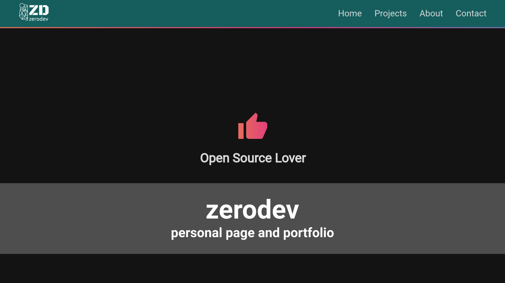

# zerodev

My personal page and portfolio.

Client built in React, backend is a nodejs-server(Express).
I will provide APIs and Documentation on this site.

## Planned API Routes
 * /api/downloads

### Server Dependencies

* express
* config

### Server Dev Dependencies4

- nodemon
- concurrently
- postbuild -- to built reactapp on server

### Client Dependencies

- react-router-dom
- materialize-css
- node-sass
- react-fontawesome
- free-solid-svg-icons
- fontawesome-svg-core

### Client Dev Dependencies

### Deployment
* install heroku globally
* in server.js set static folder --> client built folder
* setup heroku-postbuild in package.json
* include clientside dependencies in install script
